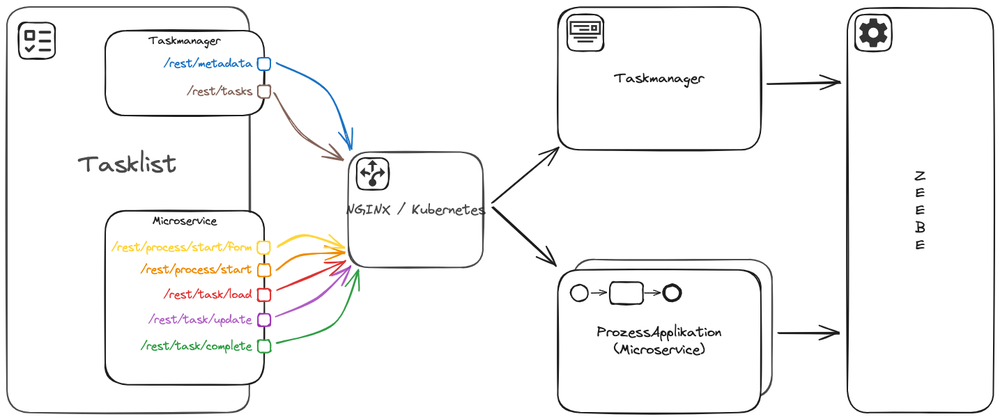
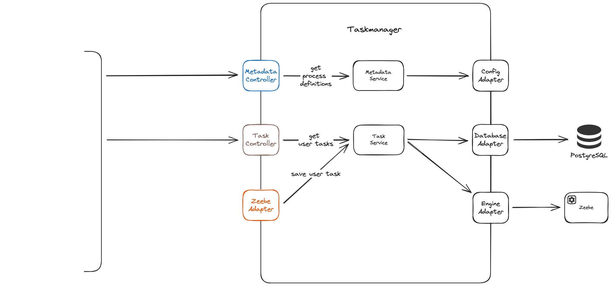
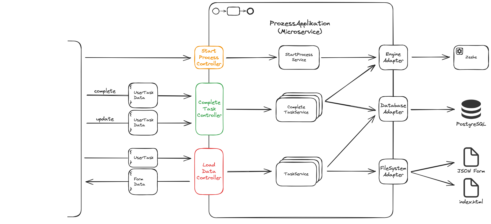

# Task-Management in einer Microservice Umgebung

# Setup

1. Start the stack (this will may take some seconds)
    ```shell
    cd stack
    docker-compose --profile prod up -d
    ```
   > ℹ️ You can use the `run scripts` if you are using `Intellij`.

2. Open the [Task-List](http://localhost:8080)

Task-List: [http://localhost:8080](http://localhost:8080)
Operate: [http://localhost:8081](http://localhost:8081)

# Overview



# Structure of the task manager



# Structure of a process application

