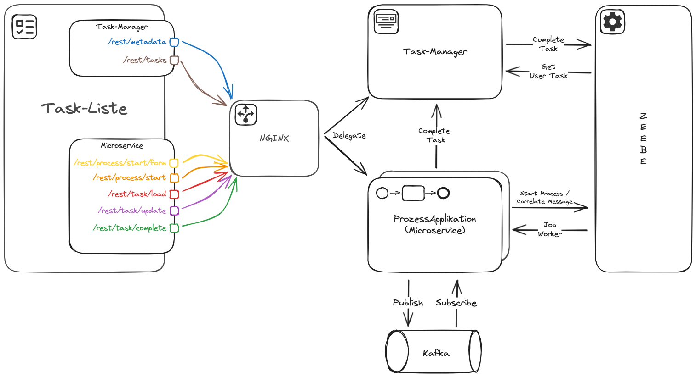

# Task-Management in einer Microservice Umgebung

# Setup

1. Build the project
    ```shell
    mvn clean package
    ```

2. Start the stack (this will may take some seconds)
    ```shell
    cd stack
    docker-compose --profile prod up -d
    ```
   > ℹ️ You can use the `run scripts` if you are using `Intellij`.

3. Open the [Tasklist](http://localhost:8081)



